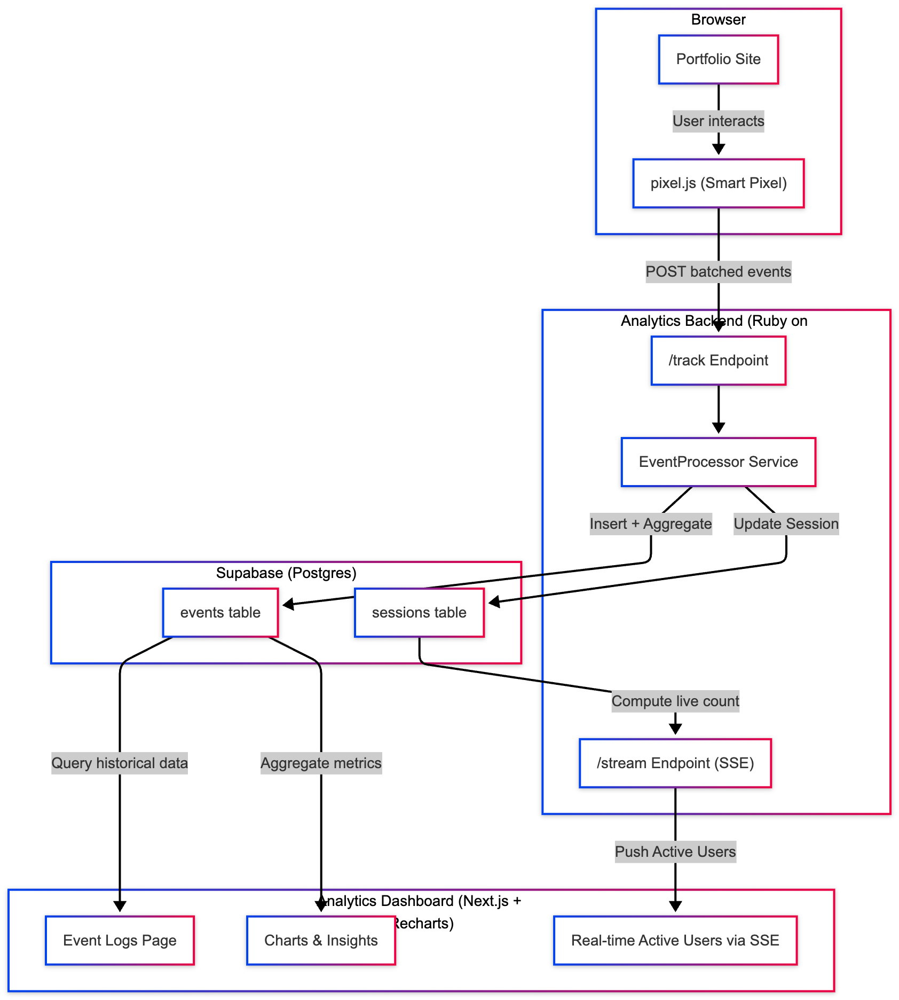

# ⚙️ Analytics Backend (Ruby on Rails)

A lightweight **Rails API service** that powers your [Realtime Analytics Dashboard](https://portfolio-analytics-theta.vercel.app/) and [Live Portfolio](https://portfolio-bay-nu-48.vercel.app/).

[Dashboard Repo](https://github.com/adeepika1991/analytics-dashboard)
This backend receives and stores **tracking events** from the embedded `pixel.js` snippet and continuously streams **live analytics** to connected dashboards using **Server-Sent Events (SSE)**.

---

## 🎯 Purpose

The Analytics Backend forms the **core of the data pipeline**, enabling real-time visibility into portfolio traffic.

It acts as:

- A **collector** for all visitor events from the portfolio
- A **real-time broadcaster** for metrics and activity
- A **historical repository** for sessions and event logs

---

## 🧩 System Overview

The backend performs three main roles:

### 🛰️ Event Ingestion

- `POST /track` endpoint receives event payloads from the embedded `pixel.js`.
- Events include `url`, `referrer`, `session_token`, and metadata (like click labels).

### 💾 Persistence

- Events and sessions are stored in a **PostgreSQL** database.
- Associations:
  - `Session` → has many `Events`
  - `Event` → belongs to a `Session`
- Optional `pgvector` or JSON fields can enhance metadata querying later.

### 📡 Real-time Streaming

- `GET /stream` streams data via **ActionController::Live**.
- Periodically emits:
  - `active_users` (based on last seen time)
  - `visits_last_min`
  - `top_clicks`
  - `recent_events`
- SSE messages are pushed every few seconds to connected dashboards.

---

## ⚙️ Key Endpoints

| Endpoint    | Method | Description                                            |
| ----------- | ------ | ------------------------------------------------------ |
| `/track`    | `POST` | Receives event payloads from Pixel.js                  |
| `/stream`   | `GET`  | Streams live analytics to dashboards via SSE           |
| `/sessions` | `GET`  | _(Optional future)_ List sessions and activity summary |
| `/events`   | `GET`  | _(Optional future)_ Query past events for charting     |

---

## 💡 Technical Highlights

- **Rails + ActionController::Live** for persistent event streams
- **PostgreSQL** for session/event storage
- **Lightweight ActiveRecord models** (`Session`, `Event`)
- **CORS-enabled** for safe dashboard–backend communication
- **Auto heartbeat** keeps SSE connection alive
- **Safe payload gathering** — gracefully handles DB or timeout errors

---

## 🧠 What Could Be Added Next

- **Historical Analytics Endpoints**

  - `/stats/hourly`, `/stats/daily`, `/top-pages`

- **GeoIP Enrichment**

  - Enrich session data with geolocation or device info.

- **Anomaly Detection**

  - Detect sudden spikes or inactivity.

- **Redis Stream Buffer**
  - For queue-based scaling under high traffic.

---

## 🗺️ Architecture Diagram

> The diagram shows how the backend connects the portfolio and dashboard — ingesting tracking data and streaming structured analytics to the UI.

---

## 🔄 Data Flow Summary

1. **Pixel.js** (in your portfolio) sends tracking events to `/track`.
2. The **backend stores** each event and associates it with a session.
3. The **backend aggregates metrics** (active users, visits, top clicks).
4. `/stream` pushes real-time updates to the **Next.js dashboard**.

---

## 🌍 Live Services

- **Portfolio:** [https://portfolio-bay-nu-48.vercel.app/](https://portfolio-bay-nu-48.vercel.app/)
- **Dashboard:** [https://portfolio-analytics-theta.vercel.app/](https://portfolio-analytics-theta.vercel.app/)
- **Backend:** Private Rails API (runs locally or deployed on port `4000`)

---
